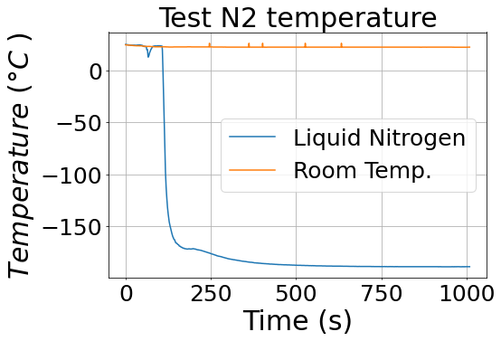

# Read_TMD_tempData
Python code for reading temperature data from the Amprobe TMD-56
# Example:
using K-type probes, I immersed 1 probe into Liquid nitrogen dewar right above surface of the liquid (did not confirm it was immersed)
K-type probes go down to -200 degrees Celsius.
Liquid nitrogen boiling point is -195 Celsius

# TMD output
these files are usually saved here - >C:\{TMD series install location}\record\

## links
Manual for the TMD Series software: https://www.manualslib.com/manual/2344732/Amprobe-Tmd-Series.html
The product: https://www.amprobe.com/product/tmd-56/
amazon reviews: https://www.amazon.com/Amprobe-TMD-56-Multi-Logging-Thermometer-Accuracy/product-reviews/B005GFHZLG
tmd series software: https://www.amprobe.com/software-downloads/
